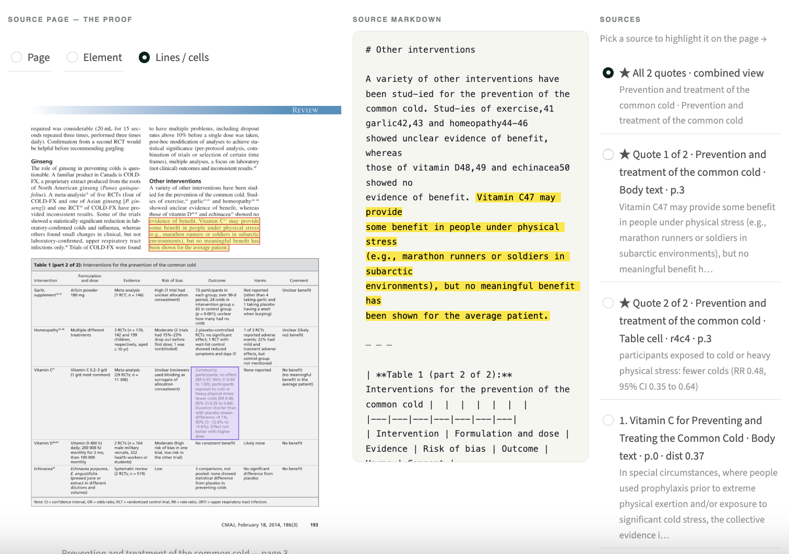

# Verifiable, Hierarchical RAG on Scientific Literature

A Streamlit app that turns 8 medical journal PDFs about the common cold and vitamin C into a verifiable Q&A app. Every answer is grounded in a verbatim quote that gets resolved back to the **exact line or table cell** on the source page using DPT-3's hierarchical structure tree and line-level grounding map.
This sample is built on LandingAI's DPT-3 Parse API. For how the API itself works, see the blog:
**[DPT-3 Parse for developers](https://landing.ai/blog/dpt3-parse-announcement-for-developers)**.



*Every answer resolves back to the exact spot on the source page — here, a flowchart question grounded to the precise lines and the figure on the original page.*


## Demo
[](https://www.youtube.com/watch?v=VIDEO_ID)

## Quick start

### 1. Install

```bash
python3 -m venv venv
source venv/bin/activate
pip install -r requirements.txt
```

Python 3.10+ recommended.

### 2. Configure

Copy `.env.example` to `.env` and fill in your keys:

```bash
cp .env.example .env
```

```
VISION_AGENT_API_KEY=pat_your_key_here   # https://va.landing.ai/settings/api-key
ANTHROPIC_API_KEY=sk-ant-your_key_here   # https://console.anthropic.com/settings/keys
```

### 3. Add documents

Drop PDFs in `input/`. This demo ships with 8 cold/vitamin-C papers from the public literature. Any PDFs work.

### 4. Parse + cache

```bash
python ingest.py
```

This:
- Sends each PDF to `https://api.ade.landing.ai/v2/parse` (the DPT-3 endpoint)
- Caches the full JSON response (markdown + structure + grounding + metadata) to `parsed/<doc>.json`
- Pre-rasterizes each page to PNG at 144 dpi in `pages/<doc>/page_<n>.png` for fast Streamlit rendering
- Runs 4 PDFs in parallel; idempotent (skips work for any doc already cached)

### 5. Build the retrieval index

```bash
python build_index.py
```

Walks every cached parse and emits one chunk per top-level element (text, table, figure, marginalia, logo, card, scan_code, attestation). Tables stay whole — their cells remain queryable via grounding, not as separate chunks. Embeds with ChromaDB's default Sentence Transformers (`all-MiniLM-L6-v2`), persists to `chroma/`.

### 6. Run the app

```bash
streamlit run app.py
```

Open the browser tab Streamlit shows you. Try a sample chip — `Table 1 — general community RR` is the headline showpiece for cell-level grounding.

### Verification log

Every Accept / Reject click in the UI appends one line of JSON to `verifications.jsonl`:

```json
{"ts":"2026-05-26T17:42:11","question":"...","quote":"RR = 0.98 (0.95, 1.00)","source_doc":"Vitamin_C...","source_element_id":"47","judgment":"accept"}
```

Use this to build a labeled set of "grounded answers that were right" vs "grounded answers that were wrong" for model evaluation.

## Architecture

```
input/                      ← your PDFs
   ↓ ingest.py (parallel)
parsed/<doc>.json           ← cached DPT-3 parse responses
   ↓ build_index.py
chroma/                     ← embedded chunks, persistent
   ↓ app.py
   ├─ ChromaDB retrieval (filters marginalia)
   ├─ Claude with tool-forced JSON ({answer, exact_quote, source_doc, element_id})
   ├─ parse_helpers.find_quote_span  → spans into source markdown
   ├─ parse_helpers.get_grounding    → element-level + precise boxes
   ├─ parse_helpers.cluster_matches  → de-dup nested matches (e.g. table + cell)
   └─ parse_helpers.render_overlays  → page-level / element-level / precise overlays,
                                       multi-quote with per-quote colors
```

## File structure

| File | Purpose |
|---|---|
| `app.py` | Streamlit UI: hero, sample chips, 3-column answer layout, sources radio, granularity zoom, HITL log |
| `ingest.py` | Parallel parse + cache + pre-rasterize |
| `build_index.py` | Walk cached parses, chunk, embed, store in ChromaDB |
| `query_engine.py` | Retrieval + Claude tool-forced JSON Q&A (single- or multi-quote) |
| `parse_helpers.py` | Spans, grounding, multi-axis overlay rendering, precision metric — the core RAG-with-grounding library |
| `.env.example` | API key template |
| `.streamlit/config.toml` | Brand theme (Forest primary) |
| `static/landing_ai_logo.svg` | LandingAI horizontal wordmark — painted in the upper-right via CSS `::before` |

## Sample queries to try

| Query | What it demonstrates | Expected win |
|---|---|---|
| `Did the studies find a benefit for marathon runners taking vitamin C?` | Line-level grounding in a dense paragraph | ~3–5× |
| `In the Vitamin C meta-analyses Table 1, what was the relative risk for incidence of colds in the general community studies?` | Cell-level grounding inside a 49-cell table | **~32×** |
| `Does vitamin C work for either preventing or shortening the common cold?` | **Multi-quote / non-contiguous evidence** — two highlights in distinct colors across two passages | qualitative |
| `What do the coronal sinus CT scans look like during the acute and recovery phases of a cold?` | Figure grounding — the highlight is the whole CT-scan image, not text | qualitative |
| `Is echinacea effective for preventing the common cold?` | Cross-document retrieval | qualitative |
