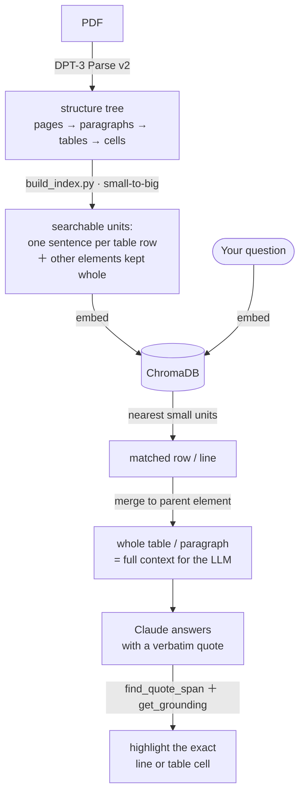

# Verifiable, Hierarchical RAG on Scientific Literature

A Streamlit demo that turns 8 medical journal PDFs about the common cold and vitamin C into a verifiable Q&A app. Every answer is grounded in a verbatim quote that gets resolved back to the **exact line or table cell** on the source page — not the whole paragraph or table — using DPT-3's hierarchical structure tree and line-level grounding map.

> **Why the answers are accurate — row-wise retrieval.** The app searches each table
> **row by row**, not table-by-table. DPT-3's line- and cell-level parsing turns every
> row into its own searchable sentence (carrying its column headers), so a question about
> one value lands on the **exact cell** instead of drowning in a 100-cell block — in this
> corpus that moved the right table from search rank **5th → 1st**. A plain text extractor
> can't do this: it has no rows, columns, or cells to turn into sentences. See
> [How indexing and retrieval work](#how-indexing-and-retrieval-work).


*The proof view — the answer's exact words highlighted on the original source page, down to the precise line or table cell.*

## Demo

<!-- After uploading demo/verifiable-rag-demo.mp4 as an unlisted YouTube video,
     replace both VIDEO_ID occurrences below with the real video id. -->
[](https://www.youtube.com/watch?v=VIDEO_ID)

*~1-minute walkthrough — line- & cell-level grounding over 8 medical papers. DPT-3 Parse v2 renders the sneezing-reflex flowchart as text, reconstructs a line chart's data points, reads a borderless microbiology table down to a single cell, recovers 3-column reading order, and describes CT-scan arrow directions — each answer grounded to the exact region on the source page.*

## What It Does

Ask a medical question and get an answer you can verify at a glance — the app shows you
the exact spot on the source page that backs every answer, down to a single line or one
cell of a table.

**Ask**
- Pick a sample question or type your own.
- Set how many passages to pull in with a slider.
- Get a short answer with the exact sentence from a paper quoted as its proof.
- Mark each answer **Accept** or **Reject** — saved to a log (`verifications.jsonl`).

**See the proof** (appears the moment an answer lands)
- The exact text it used, side by side with a picture of the real page — the same spot
  highlighted on both.
- A zoom toggle — **Page · Block · Lines/cells** — that tightens the highlight from the
  whole page, to the block, to the single line or table cell.
- A label saying what it found and where: `Body text · p.3`, `Table cell · r3c2 · p.1`,
  `Figure · p.4`.
- Tiles showing how much tighter the highlight got, and how little text you'd need to
  hand an AI to back the answer.
- A list of every passage it pulled — click any one to highlight it on the page. When an
  answer draws on two far-apart places, it highlights both, in different colors.

## How indexing and retrieval work

Indexing and retrieval are two separate stages, and the split is the whole trick:
**retrieve small, read big, ground precise.**



*Top half (A→D) is indexing, run once; bottom half (question→H) is what happens on every query.*

### Indexing — `build_index.py`

DPT-3 parses each PDF into a structure tree (pages → paragraphs → tables → cells). The
indexer turns that tree into searchable units, *small-to-big*:

- a **table** becomes **one short sentence per row**, rebuilt from the row label and the
  column headers — e.g. `Coronavirus 229E. Serology: 10 (5); Total: 10 (5)`;
- **text, figures, and other elements** stay **whole**.

Every unit carries a pointer back to its **parent element**. The units are embedded with
ChromaDB's default Sentence Transformers (`all-MiniLM-L6-v2`) and persisted to `chroma/`.

#### Why does slicing smaller make it *more* accurate? The smoothie problem 🥤

An embedding squeezes a piece of text into a **single point on a "meaning map"** — similar
meanings land near each other, and search just grabs the nearest points to your question.

Embed a **whole table** and you've dumped all ~120 cells — every organism, every number —
into a blender and read back **one averaged smoothie**. Your sharp question ("how many
*Coronavirus 229E*?") tastes nothing like that muddy brown average, so the table ranks a
sad **5th**.

Embed **one row at a time** and each row keeps its own clean flavor —
`Coronavirus 229E. Serology: 10 (5)` — so your question matches it crisply and it jumps to
**1st**. Same blender (same embedding model); you just *stopped blending.* 🍓

*(And no — a fancier "re-ranker" doesn't rescue the smoothie. We tried: it nudged the
table from 5th to 6th. Once it's blended, it's blended — you have to slice before you
embed.)*

**Why this needs DPT-3.** To turn a row into a clean sentence you have to know **which
cells belong to which row** and **what each column header says** — even when the table has
no visible gridlines at all. DPT-3's line- and cell-level parse hands you exactly that:
rows, columns, headers, and a bounding box for every cell. A plain text extractor gives
you a wall of words with no idea where the rows even are, so you're stuck blending the
whole table. **Line-level *parsing* is what makes line-level *retrieval* possible** — and
the same cell boxes are what later let the answer highlight land on one cell.

### Retrieval — `query_engine.py` + `parse_helpers.py`

1. Embed the question and find the closest **small units** (e.g. the Coronavirus row).
2. **Merge each match back to its parent element** — a matched row becomes the whole
   table, a matched line becomes its paragraph — so the model always sees full context,
   never a stray fragment. (Marginalia like page headers are filtered out.)
3. Send those parent passages to Claude, which answers and must quote a source **verbatim**.
4. `find_quote_span` locates that quote in the parsed markdown and `get_grounding`
   resolves it to the **exact line or table cell** to highlight.

So retrieval granularity (precise) and reading granularity (full context) are
**decoupled** — that's what lets the highlight land on a single cell while the model
still reasons over the whole table. The app shows the contrast live in the
*"How the app found the right cell in this table"* panel.

## Quick start

### 1. Install

```bash
python3 -m venv venv
source venv/bin/activate
pip install -r requirements.txt
```

Python 3.10+ recommended.

### 2. Configure

Copy `.env.example` to `.env` and fill in your keys:

```bash
cp .env.example .env
```

```
VISION_AGENT_API_KEY=pat_your_key_here   # https://va.landing.ai/settings/api-key
ANTHROPIC_API_KEY=sk-ant-your_key_here   # https://console.anthropic.com/settings/keys
```

### 3. Add documents

Drop PDFs in `input/`. This demo ships with 8 cold/vitamin-C papers from the public literature. Any PDFs work.

### 4. Parse + cache

```bash
python ingest.py
```

This:
- Sends each PDF to `https://api.ade.landing.ai/v2/parse` (the DPT-3 endpoint)
- Caches the full JSON response (markdown + structure + grounding + metadata) to `parsed/<doc>.json`
- Pre-rasterizes each page to PNG at 144 dpi in `pages/<doc>/page_<n>.png` for fast Streamlit rendering
- Runs 4 PDFs in parallel; idempotent (skips work for any doc already cached)

Total cost for the 8-doc sample corpus: ~170 credits (a one-time spend; the cache is durable).

### 5. Build the retrieval index

```bash
python build_index.py
```

Walks every cached parse and builds the **small-to-big** search index — one header-aware sentence per table row, other elements kept whole — embedded with ChromaDB's Sentence Transformers (`all-MiniLM-L6-v2`) into `chroma/`. See [How indexing and retrieval work](#how-indexing-and-retrieval-work) for the full logic.

### 6. Run the app

```bash
streamlit run app.py
```

Open the browser tab Streamlit shows you. Try a sample chip — `Table 1 — general community RR` is the headline showpiece for cell-level grounding.

## Architecture

```
input/                      ← your PDFs
   ↓ ingest.py (parallel)
parsed/<doc>.json           ← cached DPT-3 parse responses
   ↓ build_index.py
chroma/                     ← embedded small-to-big units (one per table row + one per other element)
   ↓ app.py
   ├─ ChromaDB retrieval: match a fine unit, then merge to its parent element (filters marginalia)
   ├─ Claude with tool-forced JSON ({answer, exact_quote, source_doc, element_id})
   ├─ parse_helpers.find_quote_span  → spans into source markdown
   ├─ parse_helpers.get_grounding    → element-level + precise boxes
   ├─ parse_helpers.cluster_matches  → de-dup nested matches (e.g. table + cell)
   └─ parse_helpers.render_overlays  → page-level / element-level / precise overlays,
                                       multi-quote with per-quote colors
```

(The retrieval + grounding logic is explained in [How indexing and retrieval work](#how-indexing-and-retrieval-work).)

## File structure

| File | Purpose |
|---|---|
| `app.py` | Streamlit UI: hero, sample chips, proof-first answer layout (answer card, metric chips, quote callout, source-page hero), sources list, granularity zoom, HITL log |
| `ingest.py` | Parallel parse + cache + pre-rasterize |
| `build_index.py` | Walk cached parses, emit small-to-big units (table rows + whole elements), embed, store in ChromaDB |
| `query_engine.py` | Small-to-big retrieval (match fine unit → merge to parent) + Claude tool-forced JSON Q&A (single- or multi-quote) |
| `parse_helpers.py` | Spans, grounding, multi-axis overlay rendering, precision metric — the core RAG-with-grounding library |
| `.env.example` | API key template |
| `.streamlit/config.toml` | Brand theme (Forest primary) |
| `static/landing_ai_logo.png` | LandingAI wordmark — shown in the hero card's top-right via CSS `::after` |

## Sample queries to try

| Query | What it demonstrates | Expected win |
|---|---|---|
| `Did the studies find a benefit for marathon runners taking vitamin C?` | Line-level grounding in a dense paragraph | ~3–5× |
| `In the Vitamin C meta-analyses Table 1, what was the relative risk for incidence of colds in the general community studies?` | Cell-level grounding inside a 49-cell table | **~32×** |
| `Does vitamin C work for either preventing or shortening the common cold?` | **Multi-quote / non-contiguous evidence** — two highlights in distinct colors across two passages | qualitative |
| `What do the coronal sinus CT scans look like during the acute and recovery phases of a cold?` | Figure grounding — the highlight is the whole CT-scan image, not text | qualitative |
| `Is echinacea effective for preventing the common cold?` | Cross-document retrieval | qualitative |

## Tech notes

### How DPT-3 Parse works

This sample is built on LandingAI's DPT-3 Parse API. For how the API itself works — the
response shape (`markdown`, `structure`, `grounding`, `metadata`), spans, and line- and
cell-level grounding — see the developer announcement:
**[DPT-3 Parse for developers](https://landing.ai/blog/dpt3-parse-announcement-for-developers)**.

The notes below are the practical details this app relies on.

### Endpoint

`https://api.ade.landing.ai/v2/parse`. The response shape returns four top-level fields: `structure`, `grounding`, `markdown`, and `metadata`.

### Auth

`Authorization: Basic <pat_xxx>` — the raw personal access token, no base64 wrapping. The app uses `python-dotenv` with `override=True` so the value in `.env` wins over any pre-existing shell `VISION_AGENT_API_KEY` (a common gotcha when developers already have one exported in their shell profile).

### Known issues

- **Transient 502 from upstream `parse3-service`** for some pages on some documents. The app handles `206 Partial Content` cleanly: failed page nodes get a `status: "failed"` + `reason`, their children list is empty, and the rest of the doc is usable. Recovery: delete `parsed/<doc>.json` and re-run `ingest.py` — 502s are not sticky.
- The Anthropic SDK strictly validates the model ID. If you pin a model that doesn't exist for your workspace, you'll get a 404. Default is `claude-sonnet-4-6`; override with `ANTHROPIC_MODEL` in `.env`.

## Verification log

Every Accept / Reject click in the UI appends one line of JSON to `verifications.jsonl`:

```json
{"ts":"2026-05-26T17:42:11","question":"...","quote":"RR = 0.98 (0.95, 1.00)","source_doc":"Vitamin_C...","source_element_id":"47","judgment":"accept"}
```

Use this to build a labeled set of "grounded answers that were right" vs "grounded answers that were wrong" for model evaluation.

## License

This sample is published under the same license as [landing-ai/ade-sample-projects](https://github.com/landing-ai/ade-sample-projects).
