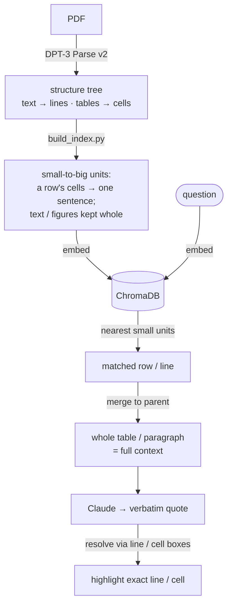

# Verifiable, Hierarchical RAG on Scientific Literature

A Streamlit demo that turns 8 medical journal PDFs about the common cold and vitamin C into a verifiable Q&A app. Every answer is grounded in a verbatim quote that gets resolved back to the **exact line or table cell** on the source page using DPT-3's hierarchical structure tree and line-level grounding map. For how the API itself works, see the blog:
**[DPT-3 Parse for developers](https://landing.ai/blog/dpt3-parse-announcement-for-developers)**.


*The proof view — the answer's exact words highlighted on the original source page, down to the precise line or table cell.*


## How indexing and retrieval work

DPT-3 parses each document down to fine-grained structure — **text to the line, tables to
the cell** (every line and cell has its own span and bounding box; cells also carry their
row, column, and header). The app keeps indexing and retrieval as two stages:
**retrieve small, read big, ground precise.**



**Indexing — `build_index.py`.** From the parsed structure it builds searchable units: for
a table, the cells of each row are assembled into **one short sentence** (e.g.
`Coronavirus 229E. Serology: 10 (5); Total: 10 (5)`); text, figures, and other elements
stay whole. Each unit points back to its parent element, and all units are embedded into
ChromaDB.

**Retrieval — `query_engine.py`.** The question is embedded and matched against those small
units; each match is then **merged back to its parent element** so the model still sees
full context. Claude answers with a verbatim quote, which `parse_helpers` resolves — via
DPT-3's line and cell boxes — to the **exact line or table cell** to highlight.

Searching a small unit (a row's sentence, a single line) matches a specific question far
better than searching a whole table or paragraph; merging to the parent keeps the
surrounding context the model needs.

### Optional: line-window text chunking (for long, dense docs)

By default, **text is indexed at the paragraph (element) level**, which retrieves prose
well when paragraphs are short and single-topic. For **long, dense documents**, you can
opt into **line-window** chunking — it uses DPT-3's per-line spans to embed each line with
a small window of neighbor lines, then merges back to the parent paragraph:

```bash
TEXT_MODE=linewin python build_index.py
```

In a quick benchmark on this corpus, line-window **sharpened retrieval for specific facts
buried in long paragraphs** (e.g. *"why are the eyes closed during a sneeze?"* improved
from ~0.70 to ~0.50 cosine distance, and two other prose queries improved) and **never
demoted the correct paragraph** — but it grows the index ~5× (more embeddings + storage),
so it's **off by default**. Enable it for long, multi-topic sections; skip it for short
prose. Full write-up in [`docs/chunking-notes.md`](docs/chunking-notes.md).

## Quick start

### 1. Install

```bash
python3 -m venv venv
source venv/bin/activate
pip install -r requirements.txt
```

Python 3.10+ recommended.

### 2. Configure

Copy `.env.example` to `.env` and fill in your keys:

```bash
cp .env.example .env
```

```
VISION_AGENT_API_KEY=pat_your_key_here   # https://va.landing.ai/settings/api-key
ANTHROPIC_API_KEY=sk-ant-your_key_here   # https://console.anthropic.com/settings/keys
```

### 3. Add documents

Drop PDFs in `input/`. This demo ships with 8 cold/vitamin-C papers from the public literature. Any PDFs work.

### 4. Parse + cache

```bash
python ingest.py
```

This:
- Sends each PDF to `https://api.ade.landing.ai/v2/parse` (the DPT-3 endpoint)
- Caches the full JSON response (markdown + structure + grounding + metadata) to `parsed/<doc>.json`
- Pre-rasterizes each page to PNG at 144 dpi in `pages/<doc>/page_<n>.png` for fast Streamlit rendering
- Runs 4 PDFs in parallel; idempotent (skips work for any doc already cached)

Total cost for the 8-doc sample corpus: ~170 credits (a one-time spend; the cache is durable).

### 5. Build the retrieval index

```bash
python build_index.py
```

Walks every cached parse and builds the small-to-big search index — for a table, the cells of each row become one short sentence; text and other elements stay whole — embedded with ChromaDB's Sentence Transformers (`all-MiniLM-L6-v2`) into `chroma/`. See [How indexing and retrieval work](#how-indexing-and-retrieval-work).

### 6. Run the app

```bash
streamlit run app.py
```

Open the browser tab Streamlit shows you. Try a sample chip — `Table 1 — general community RR` is the headline showpiece for cell-level grounding.

### Verification log

Every Accept / Reject click in the UI appends one line of JSON to `verifications.jsonl`:

```json
{"ts":"2026-05-26T17:42:11","question":"...","quote":"RR = 0.98 (0.95, 1.00)","source_doc":"Vitamin_C...","source_element_id":"47","judgment":"accept"}
```

Use this to build a labeled set of "grounded answers that were right" vs "grounded answers that were wrong" for model evaluation.


## Architecture

```
input/                      ← your PDFs
   ↓ ingest.py (parallel)
parsed/<doc>.json           ← cached DPT-3 parse responses
   ↓ build_index.py
chroma/                     ← embedded small-to-big units
   ↓ app.py
   ├─ ChromaDB retrieval: match a small unit, merge to its parent (filters marginalia)
   ├─ Claude with tool-forced JSON ({answer, exact_quote, source_doc, element_id})
   ├─ parse_helpers.find_quote_span  → spans into source markdown
   ├─ parse_helpers.get_grounding    → element-level + precise boxes
   ├─ parse_helpers.cluster_matches  → de-dup nested matches (e.g. table + cell)
   └─ parse_helpers.render_overlays  → page-level / element-level / precise overlays,
                                       multi-quote with per-quote colors
```

(The retrieval + grounding logic is explained in [How indexing and retrieval work](#how-indexing-and-retrieval-work).)

## File structure

| File | Purpose |
|---|---|
| `app.py` | Streamlit UI: hero, sample chips, proof-first answer layout (answer card, metric chips, quote callout, source-page hero), sources list, granularity zoom, HITL log |
| `ingest.py` | Parallel parse + cache + pre-rasterize |
| `build_index.py` | Walk cached parses, build small-to-big units (table rows + whole elements), embed into ChromaDB |
| `query_engine.py` | Small-to-big retrieval (match small unit → merge to parent) + Claude tool-forced JSON Q&A |
| `parse_helpers.py` | Spans, grounding, multi-axis overlay rendering, precision metric — the core RAG-with-grounding library |
| `.env.example` | API key template |
| `.streamlit/config.toml` | Brand theme (Forest primary) |
| `static/landing_ai_logo.png` | LandingAI wordmark — shown in the hero card's top-right via CSS `::after` |

## Sample queries to try

| Query | What it demonstrates | Expected win |
|---|---|---|
| `Did the studies find a benefit for marathon runners taking vitamin C?` | Line-level grounding in a dense paragraph | ~3–5× |
| `In the Vitamin C meta-analyses Table 1, what was the relative risk for incidence of colds in the general community studies?` | Cell-level grounding inside a 49-cell table | **~32×** |
| `Does vitamin C work for either preventing or shortening the common cold?` | **Multi-quote / non-contiguous evidence** — two highlights in distinct colors across two passages | qualitative |
| `What do the coronal sinus CT scans look like during the acute and recovery phases of a cold?` | Figure grounding — the highlight is the whole CT-scan image, not text | qualitative |
| `Is echinacea effective for preventing the common cold?` | Cross-document retrieval | qualitative |


