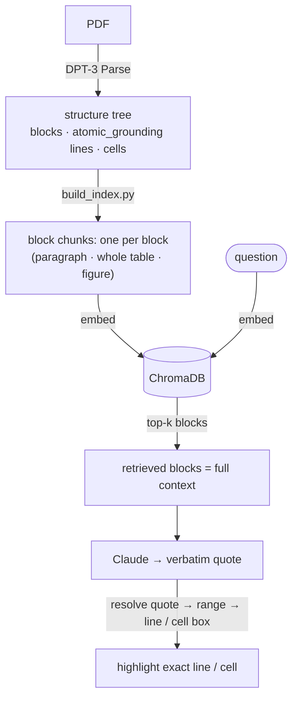

# Verifiable, Hierarchical RAG on Scientific Literature

A Streamlit demo that turns 8 medical journal PDFs about the common cold and vitamin C into a verifiable Q&A app. Retrieval works at the **block** level (whole paragraphs and tables), and every answer is grounded in a verbatim quote that gets resolved back to the **exact line or table cell** on the source page using DPT-3's per-block grounding. **Retrieve the block, highlight the line.**

<div align="center">
  <a href="https://youtu.be/WMjT06rjLSQ" target="_blank">
    
  </a>
</div>

*Click to watch: the answer's exact words highlighted on the original source page, down to the precise line or table cell.*


## How indexing and retrieval work

DPT-3 returns each document as a single `structure` tree — a `document` root whose children
are pages, whose children are the blocks on that page. Every node below the root carries its
own location inline:

```json
{
  "type": "text",
  "id": "text-1",
  "grounding": {
    "page": 1,
    "range": { "start": 29, "end": 112 },
    "box": { "xmin": 0.08, "ymin": 0.12, "xmax": 0.92, "ymax": 0.18 }
  },
  "atomic_grounding": [
    { "page": 1, "range": { "start": 29, "end": 74 },  "box": { "…": "line 1" } },
    { "page": 1, "range": { "start": 75, "end": 112 }, "box": { "…": "line 2" } }
  ]
}
```

- **`grounding`** — where the whole block is: its 1-indexed `page`, its `range` into the
  Markdown, and its `box` in normalized 0–1 page coordinates.
- **`atomic_grounding`** — the same shape one level finer: **one entry per visual line** for
  text and marginalia, one per localizable segment for figures, logos and attestations.
- **Tables** have no `atomic_grounding` — their `table_cell` children *are* the finer
  granularity, each with its own `grounding` plus `row`, `col`, `colspan`, `rowspan`.

The bridge is `range ↔ id ↔ box`. Indexing and grounding use *different* granularities:
**index the block, highlight the line.**



**Indexing — `build_index.py`.** Each top-level block becomes **one searchable chunk**: a
paragraph, a whole table, a figure caption. `parse_helpers.iter_chunks` walks the
`structure` tree and emits one chunk per leaf block (tables are kept whole — their cells
aren't indexed separately, but stay reachable at grounding time). Chunks are embedded into
ChromaDB with Sentence Transformers.

**Retrieval — `query_engine.py`.** The question is embedded and matched against those block
chunks; the top-k blocks (minus headers/footers) go to Claude as context. A whole paragraph
or table is a clean, self-contained unit both to match against and for the model to read.

**Grounding — `parse_helpers.py`.** Claude answers with a verbatim quote. The app
string-matches that quote back to a `range`, then resolves it — through each block's
`atomic_grounding` lines and each table's cells — to the **exact line or table cell** to
highlight. So the block is what gets retrieved and read, but the highlight is line-precise:
the answer points at the single line or cell that proves it, not the whole block.

Boxes are normalized 0–1 fractions of the page, so they scale to any rendering: multiply by
the width and height of whatever page image you draw on (`parse_helpers.draw_overlays`).

## Quick start

### 1. Install

```bash
python3 -m venv venv
source venv/bin/activate
pip install -r requirements.txt
```

Python 3.10+ recommended.

### 2. Configure

Copy `.env.example` to `.env` and fill in your keys:

```bash
cp .env.example .env
```

```
VISION_AGENT_API_KEY=pat_your_key_here   # https://va.landing.ai/settings/api-key
ANTHROPIC_API_KEY=sk-ant-your_key_here   # https://console.anthropic.com/settings/keys
```

### 3. Add documents

Drop PDFs in `input/`. This demo ships with 8 cold/vitamin-C papers from the public literature. Any PDFs work.

### 4. Parse + cache

```bash
python ingest.py
```

This:
- Sends each PDF to `https://api.ade.landing.ai/v2/parse` (the DPT-3 endpoint)
- Caches the full JSON response (markdown + structure with inline grounding + metadata) to `parsed/<doc>.json`
- Pre-rasterizes each page to PNG at 144 dpi in `pages/<doc>/page_<n>.png` for fast Streamlit rendering
- Runs 4 PDFs in parallel; idempotent (skips work for any doc already cached)

Total cost for the 8-doc sample corpus: ~270 credits (76 pages, `dpt-3-pro`; a one-time spend, and the cache is durable). Credit usage is reported per document under `metadata.billing.total_credits`.

### 5. Build the retrieval index

```bash
python build_index.py
```

Walks every cached parse and builds the block-level search index — one chunk per block (paragraph, whole table, figure), embedded with ChromaDB's Sentence Transformers (`all-MiniLM-L6-v2`) into `chroma/`. See [How indexing and retrieval work](#how-indexing-and-retrieval-work).

### 6. Run the app

```bash
streamlit run app.py
```

Open the browser tab Streamlit shows you. Try a sample chip — `marathon runners` is the headline showpiece: one sentence highlighted inside a dense paragraph (line-level grounding).

### Verification log

Every Accept / Reject click in the UI appends one line of JSON to `verifications.jsonl`:

```json
{"ts":"2026-05-26T17:42:11","question":"...","quote":"RR = 0.98 (0.95, 1.00)","source_doc":"Vitamin_C...","source_element_id":"47","judgment":"accept"}
```

Use this to build a labeled set of "grounded answers that were right" vs "grounded answers that were wrong" for model evaluation.


## Architecture

```
input/                      ← your PDFs
   ↓ ingest.py (parallel)
parsed/<doc>.json           ← cached DPT-3 parse responses
   ↓ build_index.py
chroma/                     ← embedded block chunks (one per block)
   ↓ app.py
   ├─ ChromaDB retrieval: top-k blocks (filters marginalia)
   ├─ Claude with tool-forced JSON ({answer, exact_quote, source_doc, element_id})
   ├─ parse_helpers.find_quote_span  → ranges into source markdown
   ├─ parse_helpers.get_grounding    → block-level box + precise line/cell boxes
   ├─ parse_helpers.cluster_matches  → de-dup nested matches (e.g. table + cell)
   └─ parse_helpers.render_overlays  → page-level / block-level / precise overlays,
                                       multi-quote with per-quote colors
```

(The retrieval + grounding logic is explained in [How indexing and retrieval work](#how-indexing-and-retrieval-work).)

## File structure

| File | Purpose |
|---|---|
| `app.py` | Streamlit UI: hero, sample chips, proof-first answer layout (answer card, metric chips, quote callout, source-page hero), sources list, granularity zoom, HITL log |
| `ingest.py` | Parallel parse + cache + pre-rasterize |
| `build_index.py` | Walk cached parses, build block chunks (one per block), embed into ChromaDB |
| `query_engine.py` | Block-level top-k retrieval + Claude tool-forced JSON Q&A |
| `parse_helpers.py` | Ranges, grounding, multi-axis overlay rendering, precision metric — the core RAG-with-grounding library |
| `.env.example` | API key template |
| `.streamlit/config.toml` | Brand theme (Forest primary) |
| `static/landing_ai_logo.png` | LandingAI wordmark — shown in the hero card's top-right via CSS `::after` |

## Sample queries to try

| Query | What it demonstrates | Expected win |
|---|---|---|
| `Did the studies find a benefit for marathon runners taking vitamin C?` | **Line-level grounding** — one sentence highlighted inside a dense paragraph | **~3–5×** |
| `Why are the eyes closed during a sneeze?` | Line-level grounding for prose buried in a long paragraph | ~4× |
| `In the Vitamin C meta-analyses Table 1, what was the relative risk for incidence of colds in the general community studies?` | Grounding into tabular data; when Claude quotes a specific cell value verbatim, the highlight narrows to that **single cell** | up to ~30× |
| `Does vitamin C work for either preventing or shortening the common cold?` | **Multi-quote / non-contiguous evidence** — two highlights in distinct colors across two passages | qualitative |
| `What do the coronal sinus CT scans look like during the acute and recovery phases of a cold?` | Figure grounding — the highlight is the whole CT-scan image, not text | qualitative |
| `Is echinacea effective for preventing the common cold?` | Cross-document retrieval | qualitative |


