## 🧪 Example Gallery

<table>
<tr>
<td width="25%"><h3>Parsing Challenge</h3></td>
<td width="75%"><h3>Example (Click to open larger version)</h3></td>
</tr>

<tr>
<td><h3>Understand dense tables</h3> Correctly interpret dense tables containing many values.</td>
<td><a href="images/play_parse_insurance_table.png">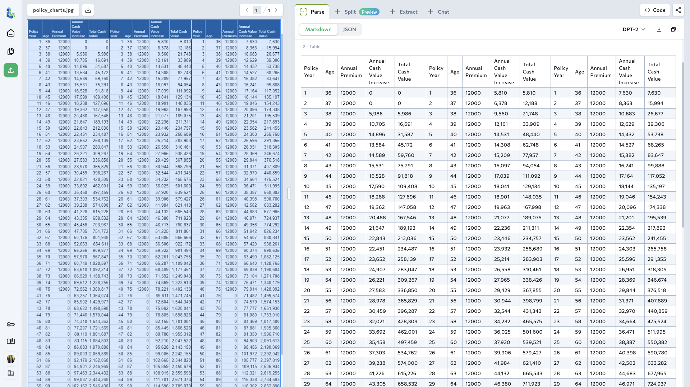</a></td>
</tr>
<tr>
<td><h3>Understand dense, small text</h3> Correctly interpret small type in legal and financial documents.</td>
<td><a href="images/play_parse_dense_text_yankee_stadium_bonds.png">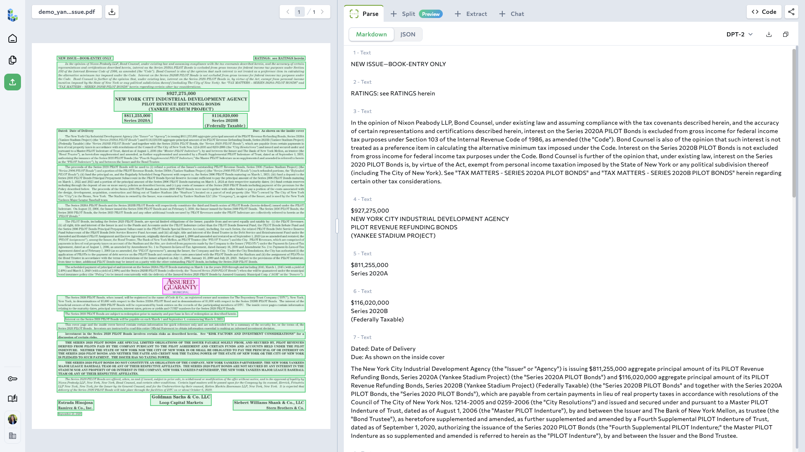</a></td>
</tr>
<tr>
<td><h3>Understand tables without gridlines</h3> Correctly interpret tables that lack clear cell boundaries.</td>
<td><a href="images/play_parse_tables_no_gridlines.png">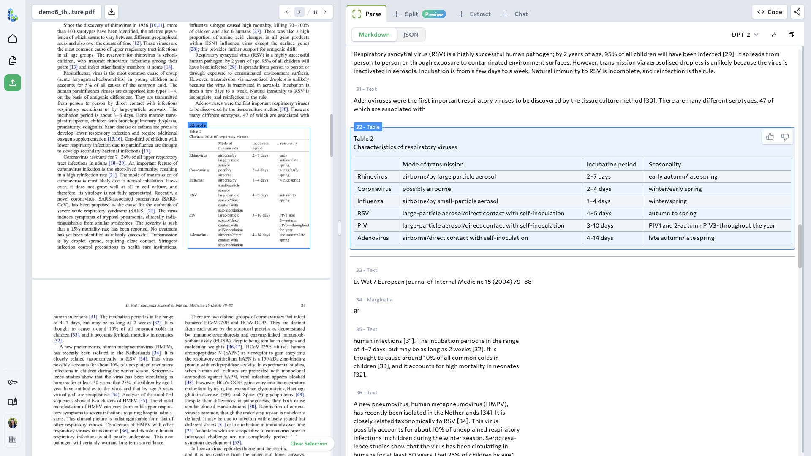</a></td>
</tr>

<tr>
<td><h3>Understand merged cells</h3> Correctly interpret tables that have merged cells. </td>
<td><a href="images/play_parse_table_rotate_merge.png">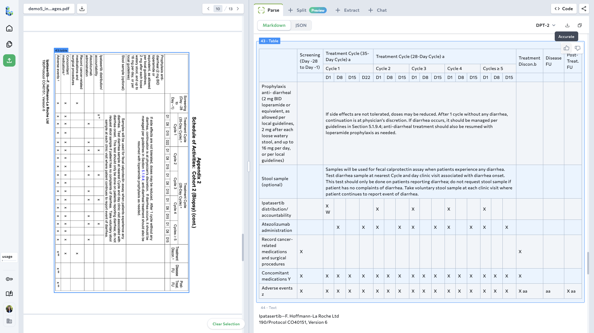</a></td>
</tr>

<tr>
<td><h3>Understand photos of forms</h3> Correctly interpret handwritten forms submits as photos. </td>
<td></td>
</tr>

<tr>
<td><h3>Understand poor quality scans</h3> Correctly interpret details on grainy scanned and faxed documents. </td>
<td><a href="images/play_parse_poor_quality_scan.png">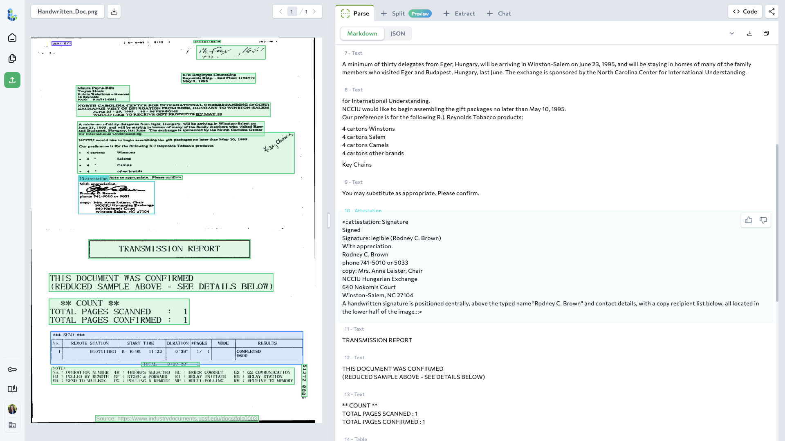</a></td>
</tr>

<tr>
<td><h3>Support for many languages</h3> Correctly transcribe text in 30+ written languages.</td>
<td><a href="images/play_parse_multilingual_text_one_document.png">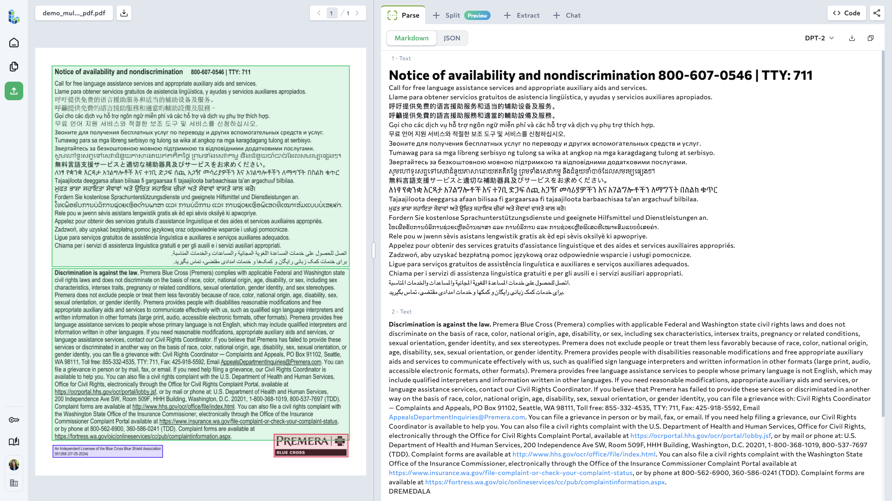</a></td>
</tr>

<tr>
<td><h3>Understand circled choices</h3> Correctly interpret forms where respondents circled selections. </td>
<td><a href="images/play_parse_handwritten_patient_checkbox_circles.png">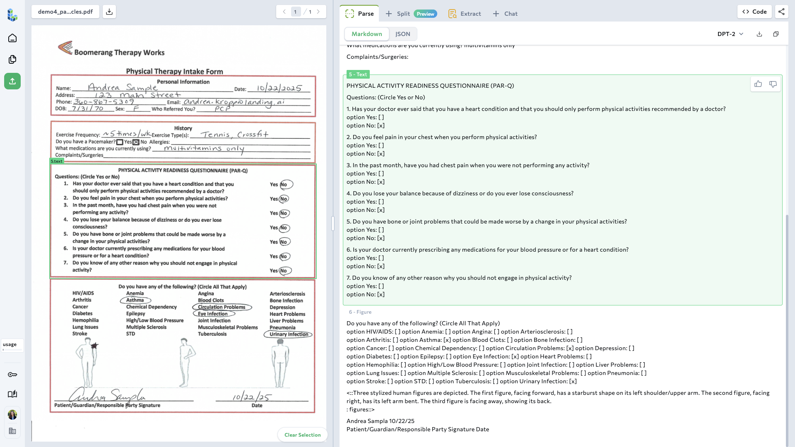</a></td>
</tr>

<tr>
<td><h3>Understand checkboxes</h3> Correctly interpret checkboxes regardless of how the respondent chooses to mark them. </td>
<td><a href="images/play_parse_checkboxes_health_form.png">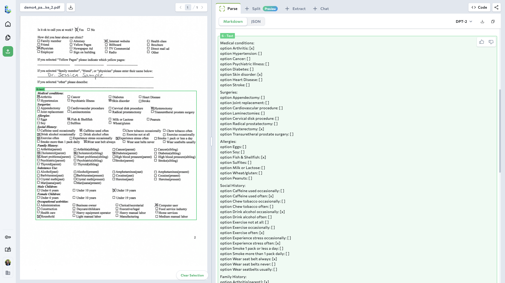</a></td>
</tr>

<tr>
<td><h3>Understand rotated content</h3> Correctly interpret pages rotated content. </td>
<td><a href="images/play_parse_rotated_handwritten_police_report.png">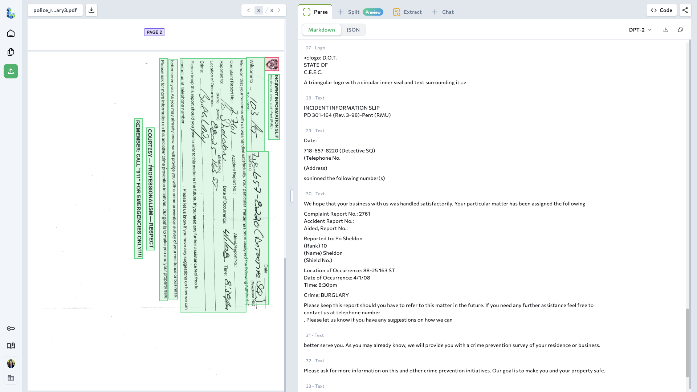</a></td>
</tr>

<tr>
<td><h3>Convert figures to data</h3> Describe charts and figures while extracting numerical avlues whenever possible.</td>
<td><a href="images/play_parse_figure_with_values_line_chart.png">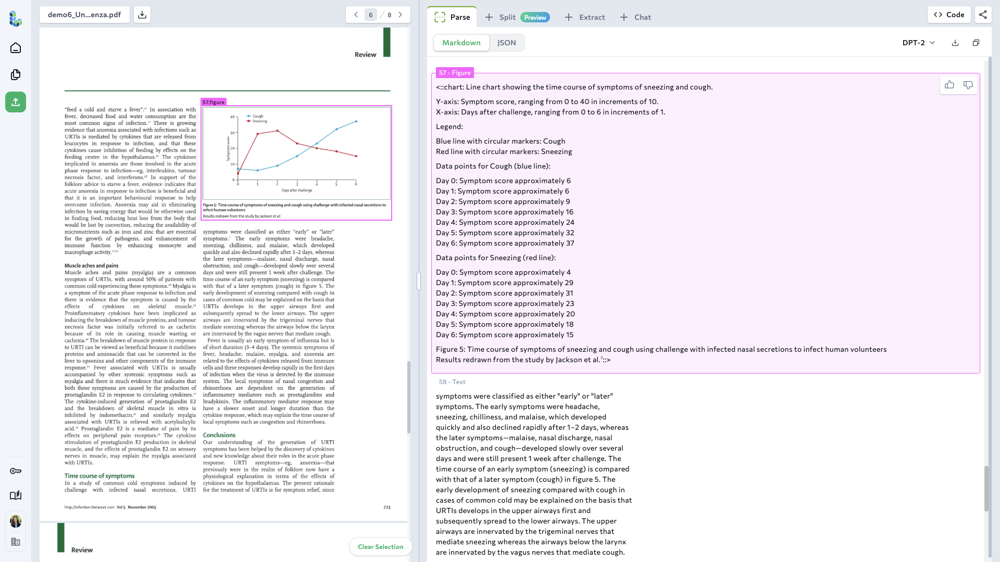</a></td>
</tr>

<tr>
<td><h3>Understand flowcharts</h3> Correctly describe the logic of a flowchart. </td>
<td><a href="images/play_parse_flowchart_description.png">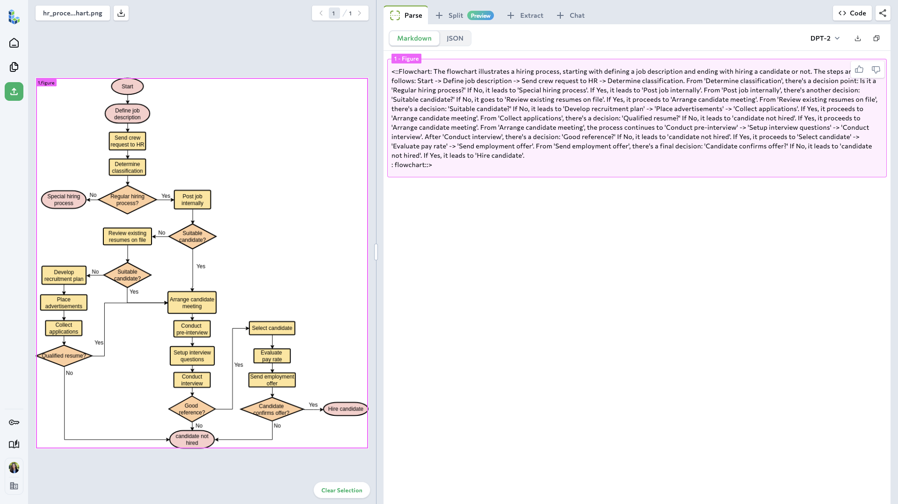</a></td>
</tr>

<tr>
<td><h3>Understand slide decks</h3> Understand the contents of presentation decks including charts and infographics.</td>
<td><a href="images/play_parse_investor_presentation_slide_deck_figures.png">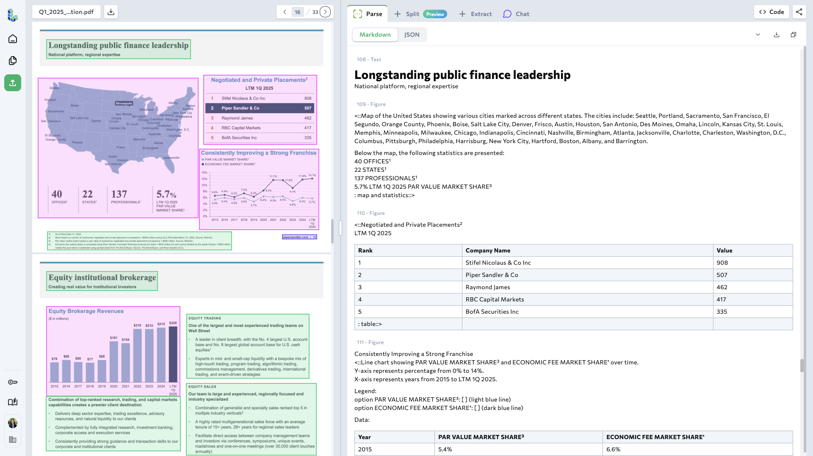</a></td>
</tr>

<tr>
<td><h3>Understand cursive</h3> Correctly interpret small cursive handwriting. </td>
<td><a href="images/play_parse_handwritten_german_cursive.png">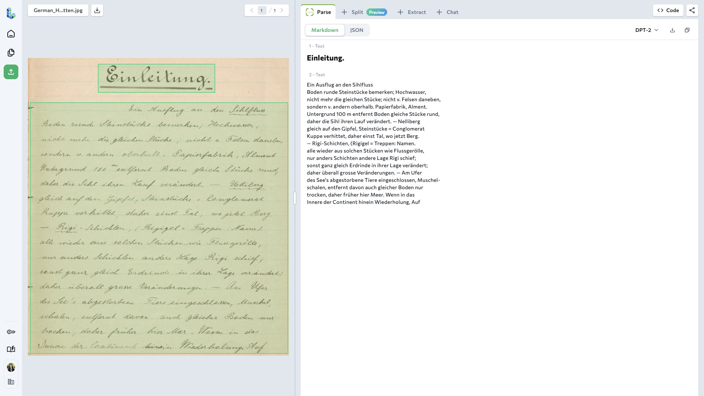</a></td>
</tr>

<tr>
<td><h3>Detect signatures</h3> Correctly identify signatures and extract names where legible. </td>
<td></td>
</tr>

<tr>
<td><h3>Detect cards</h3> Classify ids cards, passports and simialr as 'card' type. </td>
<td><a href="images/play_parse_japanese passport.png">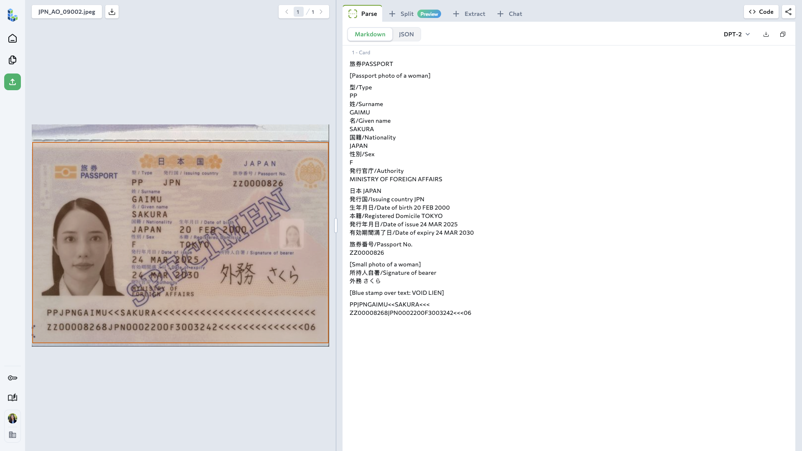</a></td>
</tr>
</table>

