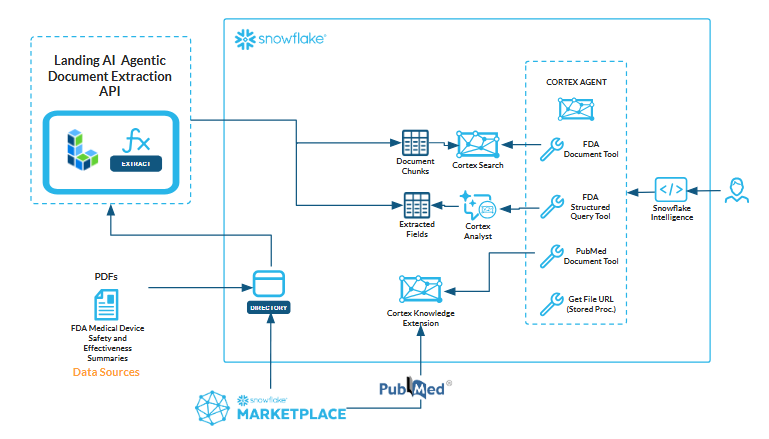

# Document Intelligence in Snowflake

This workflow demonstrates how to transform unstructured documents (e.g., FDA Safety and Effectiveness Summaries) into **AI-ready, governed assets inside Snowflake** using **LandingAI’s Agentic Document Extraction (ADE)** together with **Snowflake Cortex**.  

With this solution, you can:  
- Parse multimodal documents (text, figures, tables, footnotes) with **ADE**  
- Store parsed and structured outputs securely inside **Snowflake**  
- Query structured fields using **Cortex Analyst** (text-to-SQL)  
- Enable **RAG** (Retrieval-Augmented Generation) via **Cortex Search**  
- Enrich insights with **third-party knowledge** (e.g., PubMed) via **Cortex Knowledge Extensions**  
- Build intelligent **Cortex Agents** that orchestrate across tools  
- Provide a chat-style interface for business users with **Snowflake Intelligence**  

## Workflow in Snowflake

Here’s how the workflow works end-to-end:

1. **Load documents** – Upload unstructured FDA documents into a Snowflake stage.  
2. **Apply ADE** – Use the ADE Application's stored procedures directly in Snowflake.  
3. **Parse and extract** – ADE outputs structured fields, text chunks, visual grounding, and metadata.  
4. **Enable retrieval with Cortex Search** – Parsed chunks are indexed in a Cortex Search service for performant RAG.  
5. **Store structured fields for analytics** – Extracted fields are written into Snowflake tables and queried via **Cortex Analyst**.  
6. **Enrich with PubMed** – Add biomedical context by integrating the PubMed Biomedical Research Corpus from the Marketplace as a Cortex Knowledge Extension.  
7. **Build an intelligent agent** – A **Cortex Agent** orchestrates across Cortex Search, Cortex Analyst, and PubMed, reasoning through queries.  
8. **Empower business users** – **Snowflake Intelligence** provides a user-friendly interface to interact with the agent.  
 

## 🗂️ Repository Structure  

This repo is organized to mirror the workflow steps:  

| Folder / File | Purpose |
|---------------|---------|
| **docs/**     | The starting PDFs from the FDA used to build the soltuion. |
| **scripts/**  | The SQL script for setting up the full end-to-end solution. |
| **assets/**   | Images used in the README file |
| **README.md** | This file – overview of the workflow and instructions for usage. |

## 📋 Prerequisites  

- A **Snowflake account** with the correct role/permissions to create databases and use Cortex features.  
- Access to the **LandingAI's Agentic Document Extraction Application** from the Snowflake Marketplace.  
- Access to **Cortex Analyst, Cortex Search, Cortex Agents**, and optionally the **PubMed Cortex Knowledge Extension**.  

## References and Links

- [Agentic Document Extraction (ADE)| AI Document Intelligence by LandingAI](https://landing.ai/agentic-document-extraction)

- [ADE Visual Playground | LandingAI](https://va.landing.ai/)

- [Using ADE on Snowflake | LandingAI Documentation](https://docs.landing.ai/ade/ade-sf-overview)

- [Cortex Search | Snowflake Documentation](https://docs.snowflake.com/en/user-guide/snowflake-cortex/cortex-search/cortex-search-overview)

- [Cortex Analyst | Snowflake Documentation](https://docs.snowflake.com/en/user-guide/snowflake-cortex/cortex-analyst)

- [Cortex Agents | Snowflake Documentation](https://docs.snowflake.com/en/user-guide/snowflake-cortex/cortex-agents)

- [Cortex Knowledge Extensions | Snowflake Documentation](https://docs.snowflake.com/en/user-guide/snowflake-cortex/cortex-knowledge-extensions/cke-overview)

- [Overview of Snowflake Intelligence](https://docs.snowflake.com/en/user-guide/snowflake-cortex/snowflake-intelligence)

- [PubMed](https://dailymed.nlm.nih.gov/)

- U.S. Food & Drug Administration (FDA) device approval packages (Summaries of Safety and Effectiveness Data). All documents are publicly available through https://www.accessdata.fda.gov/scripts/cdrh/cfdocs/cfpcd/classification.cfm
The FDA does not endorse this analysis or solution.
